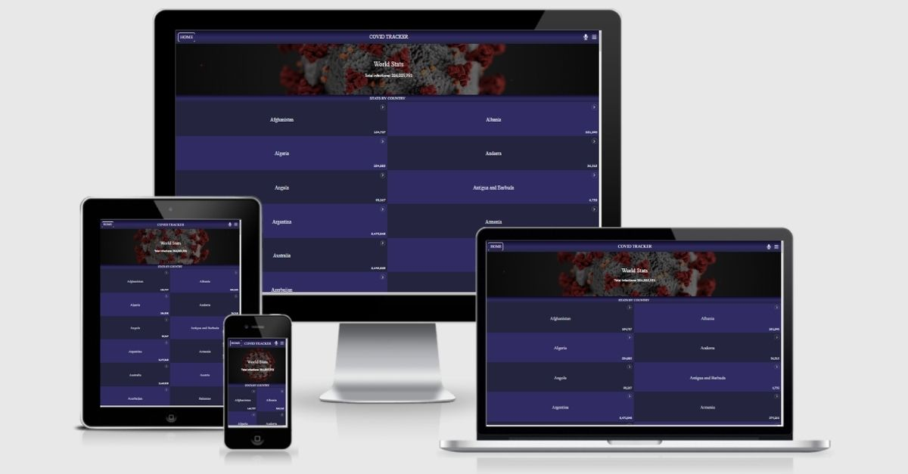
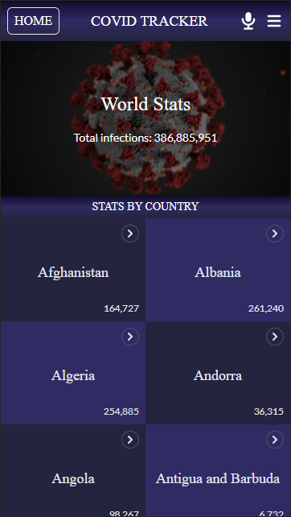
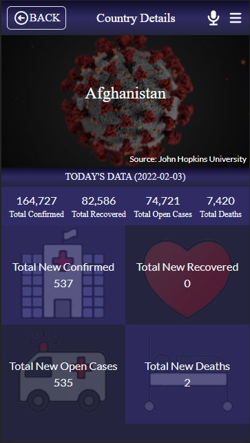
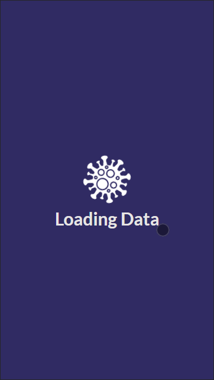

# Covid Tracker

Welcome to Covid-Tracker WebApp.
This App was developed with the intention to keep informed with the latest information about the infections statistics. This information includes:

- An overall overview of the world total infections
- An overall overview of the total contagious by country
- A detailed country view of the covid statistics, such as: recovered, new cases, and deaths

## Responsive design:

Mobile version prefered

### 📱 Mobile version

<!-- Include some screenshots of mobile version -->

#### Home Page

Here you can take a look at world statistics

#### Country Details Page

Here you have access to detailed information for each country

#### Loading Page

It will accompany you while getting the requested data

## ✅ Learning objectives

- Create SPA with React.js
- Learn and exercise the usage of SPA with React Router
- Fetch and display massive data from an external source
- Deploy SPA with different methods: GitHub Pages, Netlify, Heroku

## 🧩 Built With

<!-- - HTML & CSS -->

- React.js
- Redux Toolkit
- Linters
- TailwindCSS
- Netlify

## 📚 Getting Started

To get a local copy up and running follow these simple example steps.

### Prerequisites

<!-- For this project to run you will need the following tools: -->

For this project to run you will not need additional tools

### Setup

Fork a copy to your repository

### Install

Clone to your local enviroment
Run `npm i`

### Usage

Use your favorite code editor
Run `npm start`

## 💻📱 Live Preview

<!-- There is no Live Demo available at the moment -->

If you want to see a live demo of this project, [click here](https://wr88-covid-tracker.netlify.app/)

## Authors

👤 **William Morales**

- GitHub: [@williamrolando88](https://github.com/williamrolando88)
- Twitter: [@WillyMorales93](https://twitter.com/WillyMorales93)
- LinkedIn: [William Morales](https://www.linkedin.com/in/william-rolando-morales/)

## 🤝 Contributing

Contributions, issues, and feature requests are welcome!

Feel free to check the [issues page](../../issues).

## 👏 Show your support

Give a ⭐️ if you like this project!

## 👍 Credits

GUI & Graphic Design: Nelson Sakwa

- Behance: [Nelson Sakwa](https://www.behance.net/sakwadesignstudio)

## 📝 License

Copyright (c) 2022 William Morales

Permission is hereby granted, free of charge, to any person obtaining a copy of this software and associated documentation files (the "Software"), to deal in the Software without restriction, including without limitation the rights to use, copy, modify, merge, publish, distribute, sublicense, and/or sell copies of the Software, and to permit persons to whom the Software is furnished to do so, subject to the following conditions:

The above copyright notice and this permission notice shall be included in all copies or substantial portions of the Software.

THE SOFTWARE IS PROVIDED "AS IS", WITHOUT WARRANTY OF ANY KIND, EXPRESS OR IMPLIED, INCLUDING BUT NOT LIMITED TO THE WARRANTIES OF MERCHANTABILITY, FITNESS FOR A PARTICULAR PURPOSE AND NONINFRINGEMENT. IN NO EVENT SHALL THE AUTHORS OR COPYRIGHT HOLDERS BE LIABLE FOR ANY CLAIM, DAMAGES OR OTHER LIABILITY, WHETHER IN AN ACTION OF CONTRACT, TORT OR OTHERWISE, ARISING FROM, OUT OF OR IN CONNECTION WITH THE SOFTWARE OR THE USE OR OTHER DEALINGS IN THE SOFTWARE.
